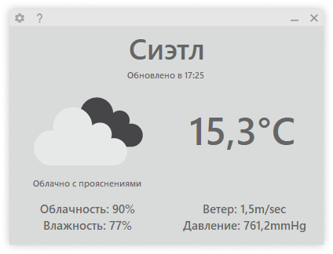
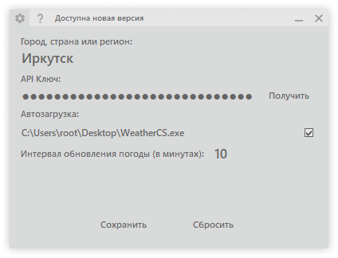
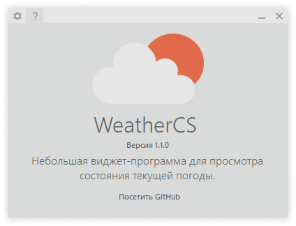

WeatherCS — Виджет-приложение
=============================

Возможности:
------------
 - Трэй
 - Смена города и API ключа
 - Автозапуск приложения

Скриншоты:
----------
<table>
	<tr>
		<td></td>
		<td></td>
		<td></td>
	</tr>
</table>

Nuget-пакеты / API:
-------------
 - [.NET Framework 4.7.2](https://dotnet.microsoft.com/download/dotnet-framework/net472)
 - [Costura.Fody](https://www.nuget.org/packages/Costura.Fody)
 - [Newtonsoft.Json](https://www.nuget.org/packages/Newtonsoft.Json/)
 - [openweathermap.org](https://openweathermap.org)
 - [ipwhois.app](https://ipwhois.app)
